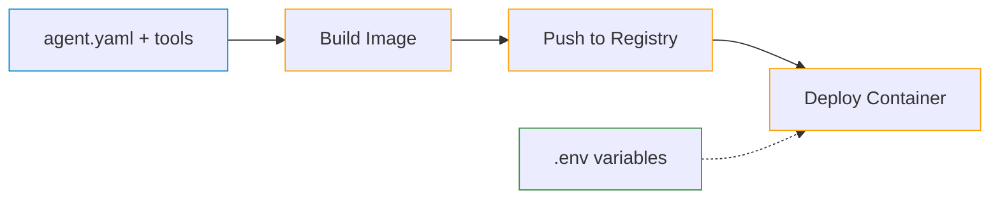
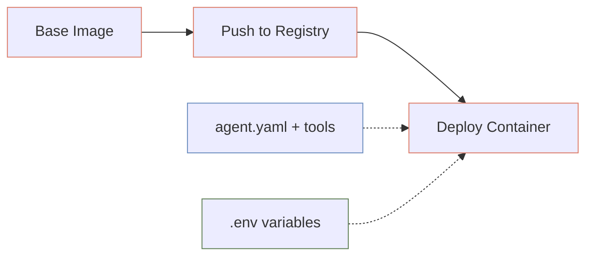

# Deployment Overview

Flexo can be deployed using two main approaches, each suited for different needs and scenarios.

---

## Deployment Approaches

### Approach 1: Build-time Configuration
With this approach, you bake your agent configuration into the container image during build time. Environment variables are still injected at runtime for security.

**Best for:**

- Stable configurations
- Version-controlled agent behavior
- Immutable deployments
- Faster container startup

### Approach 2: Runtime Configuration
With this approach, you use a base image and inject both configuration and environment variables at runtime. This allows for more flexible configuration management.

**Best for:**

- Dynamic configuration updates
- Environment-specific settings
- Testing different configurations
- Separate configuration management

---

## Deployment Process

The general deployment process follows these steps:

1. [Building the Image](building-image.md)
2. [Pushing to a Registry](registries/overview.md)
3. [Deploying to a Platform](platforms/overview.md)

---
