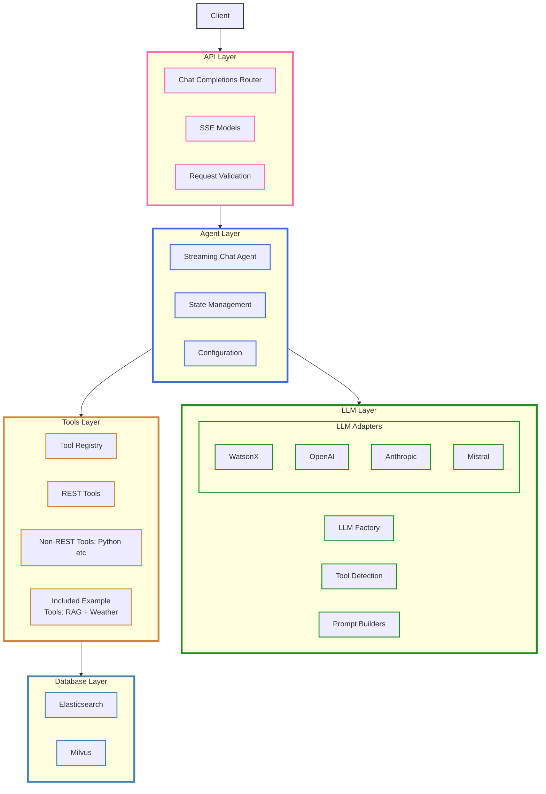
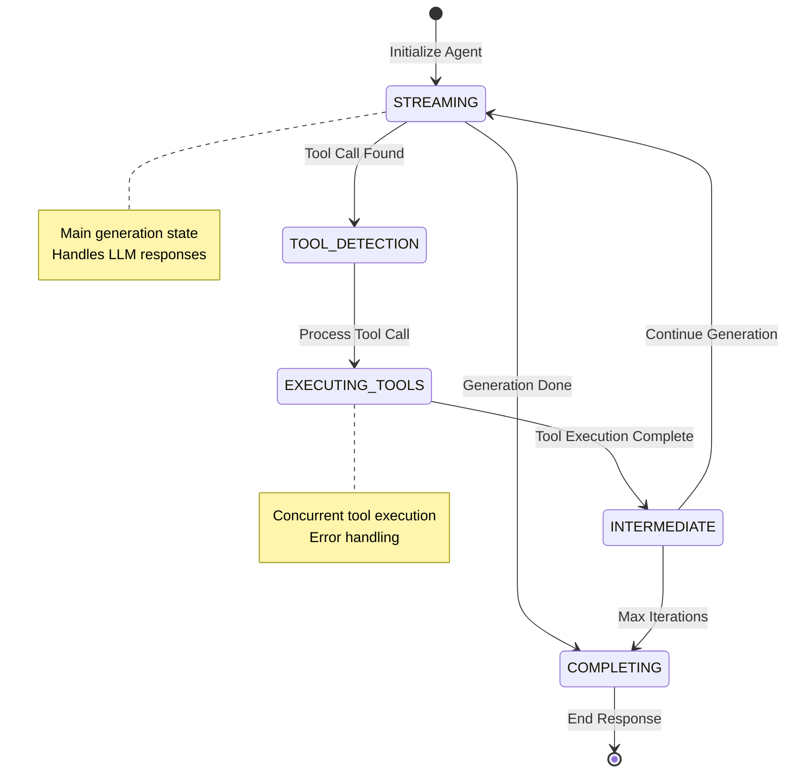

# Welcome to Flexo

The [**Flexo Agent Library**](https://github.com/IBM/flexo) is a powerful and flexible codebase that enables users to configure, customize, and deploy a generative AI agent. Designed for adaptability, the library can be tailored to a wide range of use cases, from conversational AI to specialized automation.

---

## Why Flexo?

- **Simplified Deployment**: Deploy anywhere with comprehensive platform guides
- **Production Ready**: Built for scalability and reliability
- **Extensible**: Add custom tools and capabilities
- **Well Documented**: Clear guides for every step

---

## Key Features
- **Configurable Agent**: YAML-based configuration for custom behaviors
- **Tool Integration**: Execute Python functions and REST API calls
- **Streaming Support**: Real-time streaming with pattern detection
- **Production Ready**: Containerized deployment support with logging
- **FastAPI Backend**: Modern async API with comprehensive docs

---

# Supported LLM Providers

<div class="grid" markdown style="text-align: center">

<div markdown>

<h2>☁️ Cloud Providers</h2>

<div class="provider-grid">
    <div class="provider-card">
        
        <p><strong>OpenAI</strong></p>
        <p class="description">GPT-powered models</p>
    </div>
    <div class="provider-card">
        
        <p><strong>watsonx.ai</strong></p>
        <p class="description">Enterprise AI solutions</p>
    </div>
    <div class="provider-card">
        
        <p><strong>Anthropic</strong></p>
        <p class="description">Claude family models</p>
    </div>
    <div class="provider-card">
        
        <p><strong>xAI</strong></p>
        <p class="description">Grok and beyond</p>
    </div>
    <div class="provider-card">
        
        <p><strong>Mistral AI</strong></p>
        <p class="description">Efficient open models</p>
    </div>
</div>

</div>

<div markdown style="text-align: center">

<h2>🖥️ Local & Self-Hosted Options</h2>

<div class="provider-grid">
    <div class="provider-card">
        
        <p class="description">High-throughput serving</p>
    </div>
    <div class="provider-card">
        
        <p><strong>Ollama</strong></p>
        <p class="description">Easy local LLMs</p>
    </div>
    <div class="provider-card">
        
        <p class="description">Optimized C++ runtime</p>
    </div>
    <div class="provider-card">
        
        <p><strong>LM Studio</strong></p>
        <p class="description">User-friendly interface</p>
    </div>
    <div class="provider-card">
        
        <p><strong>LocalAI</strong></p>
        <p class="description">Self-hosted versatility</p>
    </div>
</div>

</div>

</div>


## ⚙️ Unified Configuration Interface

Switch providers effortlessly with Flexo's adapter layer. Customize your LLM settings in one place:

```yaml
gpt-4o:
  provider: "openai"  # Choose your provider
  model: "gpt-4o"     # Select specific model
  temperature: 0.7
  max_tokens: 4000    # Additional model-specific parameters
```

> **Need more details?** Check our comprehensive [Model Configuration Guide](model-configuration.md) for provider-specific settings and optimization tips.

<style>
.grid {
    display: grid;
    grid-template-columns: repeat(auto-fit, minmax(300px, 1fr));
    gap: 20px;
}

.provider-grid {
    display: grid;
    grid-template-columns: 1fr;
    gap: 15px;
    margin-top: 15px;
}

.provider-card {
    text-align: center;
    padding: 15px;
    border-radius: 4px;
    background-color: rgba(255, 255, 255, 0.05);
}

.provider-card img {
    margin-bottom: 10px;
}

.provider-card p {
    margin: 5px 0;
}

.description {
    font-size: 0.9em;
    opacity: 0.8;
}
</style>

---

## Quick Start Guide

### 1. Local Development
Start developing with Flexo locally:

- [Configure Your Agent](agent-configuration.md)
- [Run the Server](getting-started.md)
- [Build from Source](deployment/building-image.md)

### 2. Production Deployment
Deploy Flexo to your preferred platform:

| Platform | Best For | Guide |
|----------|----------|-------|
| IBM Code Engine | Serverless, pay-per-use | [Deploy →](deployment/platforms/code-engine.md) |
| AWS Fargate | AWS integration | [Deploy →](deployment/platforms/fargate.md) |
| OpenShift | Enterprise, hybrid cloud | [Deploy →](deployment/platforms/openshift.md) |
| Kubernetes | Custom infrastructure | [Deploy →](deployment/platforms/kubernetes.md) |

---

## Documentation

### Deployment Guides
- [Container Registries](deployment/registries/overview.md)
- [Platform Deployment](deployment/platforms/overview.md)

### Code Reference
- [Agent](reference/agent/chat_agent_streaming)
- [API Reference](reference/api.md)
- [Model Configuration](model-configuration.md)
- [Tools System](reference/tools/index.md)
- [Data Models](reference/data_models.md)
- [Database Integration](reference/database.md)

---


## System Architecture



---

## Chat Agent State Flow




---

## Contributing
See our [Contributing Guide](https://github.com/IBM/flexo/blob/main/CONTRIBUTING.md) for details.

---

## Security
For security concerns, please review our [Security Policy](https://github.com/IBM/flexo/blob/main/SECURITY.md).

---