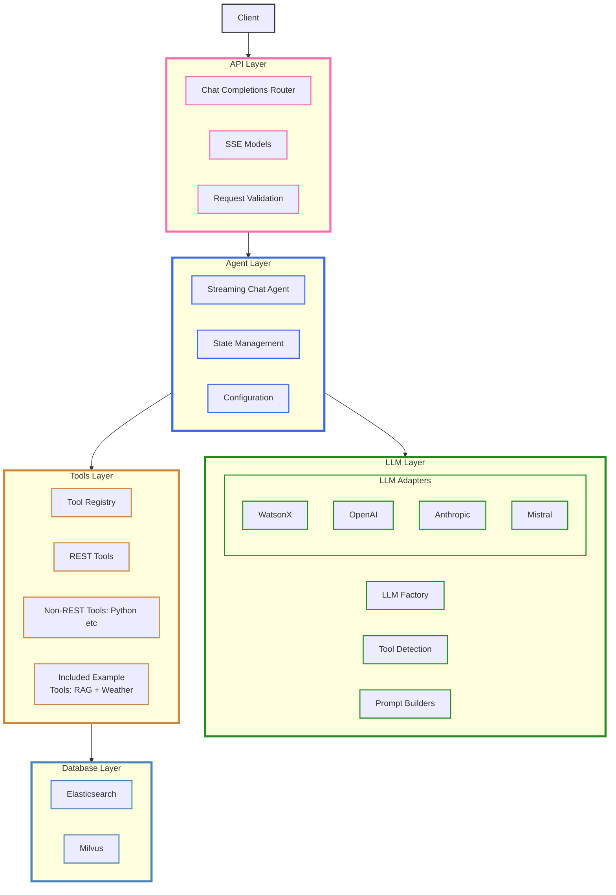
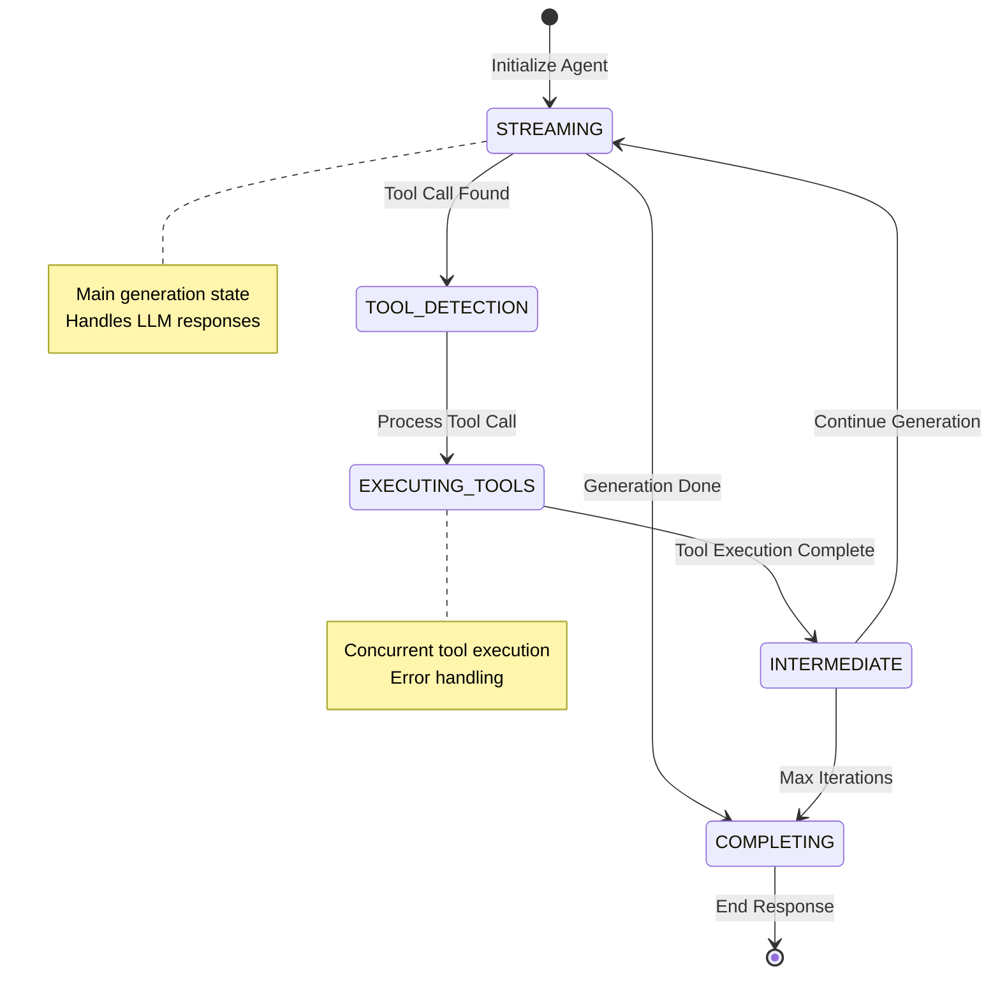

# Welcome to Flexo

The [**Flexo Agent Library**](https://github.com/IBM/flexo) is a powerful and flexible codebase that enables users to configure, customize, and deploy a generative AI agent. Designed for adaptability, the library can be tailored to a wide range of use cases, from conversational AI to specialized automation.

---

## Why Flexo?

- **Simplified Deployment**: Deploy anywhere with comprehensive platform guides
- **Production Ready**: Built for scalability and reliability
- **Extensible**: Add custom tools and capabilities
- **Well Documented**: Clear guides for every step

---

## System Architecture

---

## Chat Agent State Flow

---

## Key Features
- **Configurable AI Agent**: Modify settings to match your specific requirements
- **FastAPI-based API**: RESTful API with streaming support
- **Tool Integration**: Execute Python functions and REST API calls
- **Container Ready**: Deploy anywhere with Docker/Podman support
- **IBM AI Integration**: Optimized for watsonx.ai and other IBM services

---

## Quick Start Guide

### 1. Local Development
Start developing with Flexo locally:

- ⚡ [Quick Setup Guide](getting-started.md)
- 🔧 [Configure Your Agent](agent-configuration.md)
- 📖 [Build from Source](deployment/building-image.md)
- 🚀 [Run the Server](getting-started.md)

### 2. Production Deployment
Deploy Flexo to your preferred platform:

| Platform | Best For | Guide |
|----------|----------|-------|
| IBM Code Engine | Serverless, pay-per-use | [Deploy →](deployment/platforms/code-engine.md) |
| AWS Fargate | AWS integration | [Deploy →](deployment/platforms/fargate.md) |
| OpenShift | Enterprise, hybrid cloud | [Deploy →](deployment/platforms/openshift.md) |
| Kubernetes | Custom infrastructure | [Deploy →](deployment/platforms/kubernetes.md) |

---

## Documentation

### Deployment Guides
- 📦 [Container Registries](deployment/registries/overview.md)
- 🚀 [Platform Deployment](deployment/platforms/overview.md)

### Code Reference
- 🤖 [Agent](reference/agent/chat_agent_streaming)
- 🔌 [API Reference](reference/api.md)
- 🛠️ [Tools System](reference/tools/index.md)
- 📊 [Data Models](reference/data_models.md)
- 🗄️ [Database Integration](reference/database.md)

---

## Contributing
See our [Contributing Guide](https://github.com/IBM/flexo/blob/main/CONTRIBUTING.md) for details.

---

## Security
For security concerns, please review our [Security Policy](https://github.com/IBM/flexo/blob/main/SECURITY.md).

---