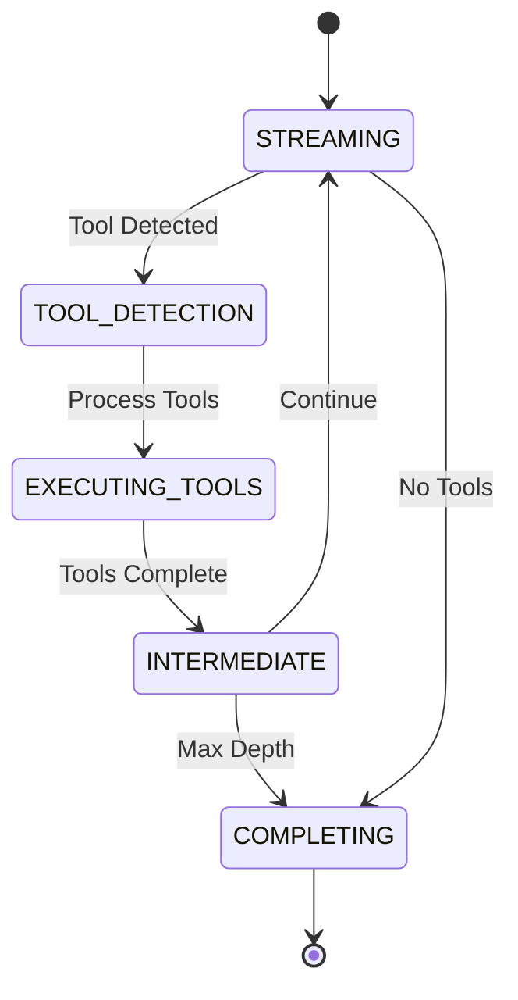

# Agent Documentation

## Overview

The Agent module is the core orchestration component of the system, responsible for managing conversational interactions and tool execution. It implements a state-based streaming architecture that handles real-time chat completions, tool detection, and execution.

## Key Components

### StreamingChatAgent

The primary class that manages the conversation flow and tool execution pipeline. It implements a state machine with the following states:

- **STREAMING**: Generates response content from the LLM
- **TOOL_DETECTION**: Identifies tool calls in the response
- **EXECUTING_TOOLS**: Runs detected tools concurrently
- **INTERMEDIATE**: Handles continuation logic and depth limits
- **COMPLETING**: Finalizes the response stream

### State Machine Flow



## Features

### Tool Detection Strategies

The agent supports two detection modes:

1. **Vendor Detection** (Default)
     - Uses LLM provider's native function calling
     - Only works with vendor-supported models
     - Automatic format handling

2. **Manual Detection**
     - Custom parser-based detection
     - More flexible for custom formats
     - Configurable parsing rules

### Concurrent Tool Execution

- Asynchronous execution of multiple tools
- Error handling and result aggregation
- Configurable maximum iteration depth

### Streaming Support

- Server-Sent Events (SSE) based streaming
- Real-time token-by-token updates
- Status updates for tool execution

## Configuration

The agent is configured through a YAML file. Please see [Agent Configuration](../../agent-configuration.md) for details.

## Usage

### Basic Chat Completion

```python
agent = StreamingChatAgent(config=config)
async for response in agent.stream_step(conversation_history):
    # Process streaming response
```

### With Tool Execution

```python
context = {"api_key": "..."} # Optional context for tools
async for response in agent.stream_step(
    conversation_history=messages,
    api_passed_context=context
):
    # Handle response chunks and tool execution updates
```

## Integration Points

The Agent module integrates with several other system components:

- **LLM Factory**: For model-specific interactions
- **Tool Registry**: Managing available tools
- **Prompt Builders**: Constructing model inputs
- **Data Models**: Structured message handling

## Error Handling

The module implements comprehensive error handling through:

- Decorator-based error catching
- Graceful error responses
- Detailed logging
- State recovery mechanisms

## See Also

- [Streaming Chat Agent Documentation](chat_agent_streaming.md)
- [Chat Completions API](../api/request_models.md)
- [Tool Registry](../tools/tool_registry.md)
