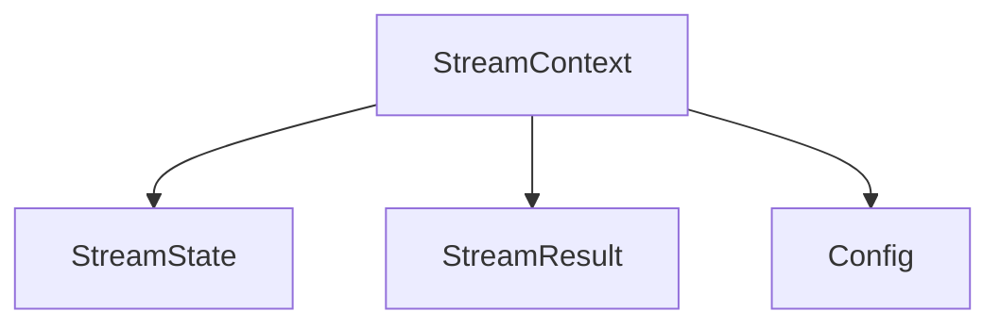
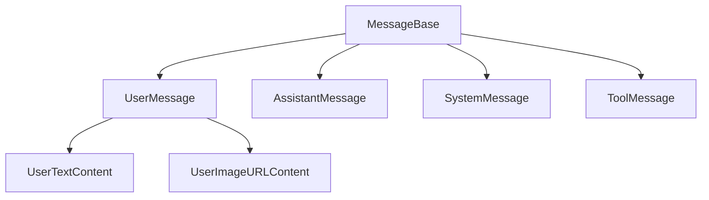
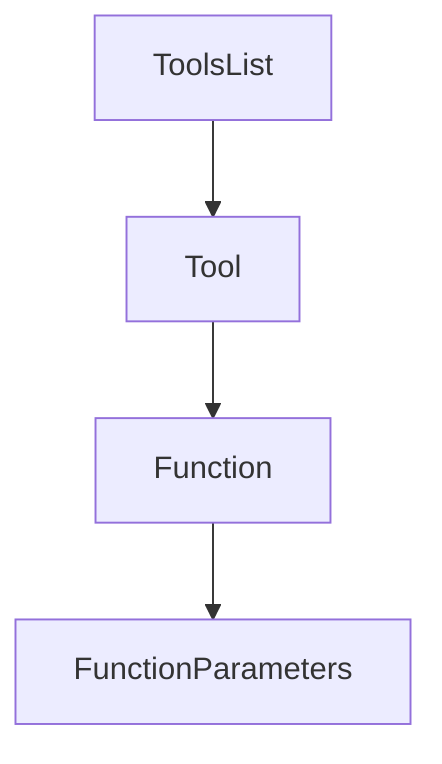

# Data Models

## Overview

The data models package provides the core data structures used throughout the application. These models define the shape of data for chat completions, streaming operations, tools/functions, and agent configurations. Each model is designed to be immutable and serializable, ensuring type safety and consistent data handling across the application.

## Core Components

### Agent Models

The agent models (`StreamState`, `StreamResult`, `StreamContext`, `Config`) handle the state and configuration of chat agents:



### Chat Completion Models

These models represent the structure of chat messages and conversations:



### Tool Models

The tool models (`Tool`, `Function`, `ToolsList`) define the structure for function calling and tool execution:



### Streaming Models

Models for handling streaming operations and pattern matching:

- `PatternMatchResult`: Represents pattern matching results during streaming
- `StreamConfig`: Configuration for streaming operations

### WX Assistant Models

Models specific to Watson Assistant integration:

- `WxAssistantMessage`: Message format for Watson Assistant
- `WxAssistantConversationInput`: Input structure for Watson Assistant conversations


## Module Structure

```
data_models/
├── agent.py          # Agent-related models
├── chat_completions.py  # Chat completion models
├── streaming.py      # Streaming operation models
├── tools.py          # Tool and function models
└── wx_assistant.py   # Watson Assistant models
```

## Common Patterns

### Message Chain Building

```python
messages = [
    SystemMessage(content="You are a helpful assistant"),
    UserMessage(content=UserTextContent(text="Hello")),
    AssistantMessage(content="Hi! How can I help you today?")
]
```

## See Also

- [Agent Documentation](../agent/index.md) - Understanding how data models are used in the agent
- [API Documentation](../api/index.md) - How data models are serialized in API responses
- [Tool Documentation](../tools/index.md) - Details on tool-specific data models