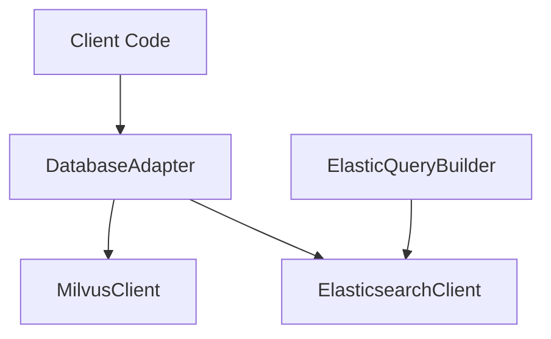

# Database Components

## Overview

The database package provides a flexible and extensible database integration layer supporting both vector and document databases. It implements an adapter pattern through the `DatabaseAdapter` interface, allowing seamless integration of different database backends while maintaining a consistent API.

## Architecture

The package consists of four main components:



## Components

### Base Adapter

The `DatabaseAdapter` abstract base class defines the core interface that all database implementations must follow. It ensures consistency across different database backends by requiring implementation of three key methods:

- `add()`: Add data to the database
- `search()`: Search for data in the database
- `reset()`: Reset or clear the database

### Vector Database (Milvus)

The `MilvusClient` implements vector database operations using Milvus. It provides:

- Vector similarity search
- Collection management
- Index creation and optimization
- Metadata handling
- Configurable schema definition

### Document Database (Elasticsearch)

The `ElasticsearchClient` provides asynchronous document database operations using Elasticsearch. Features include:

- Asynchronous document indexing and search
- Index management
- Configurable mappings and settings
- Environment-based configuration

### Query Building

The `ElasticQueryBuilder` helps construct structured queries for Elasticsearch, offering:

- Template-based query construction
- Safe user input handling
- Configurable query parameters
- Error handling and validation

## Configuration

### Milvus Configuration

```yaml
host: localhost
port: 19530
user: username   # optional
password: pass   # optional
```

### Elasticsearch Configuration

Required environment variables:
- `ES_ENDPOINT`: Elasticsearch server endpoint
- `ES_API_KEY`: API key for authentication

## Usage Examples

### Using MilvusClient

```python
# Initialize Milvus client
client = MilvusClient(
    config_file="config.yaml",
    collection_name="vectors",
    vector_dim=768,
    additional_fields=[
        {"name": "text", "dtype": DataType.VARCHAR, "max_length": 65535}
    ]
)

# Add vector with metadata
vector = [0.1, 0.2, ..., 0.768]
metadata = {"text": "document content"}
client.add(vector, metadata)

# Search vectors
results = client.search(
    vector=query_vector,
    top_k=5,
    output_fields=["text"]
)
```

### Using ElasticsearchClient

```python
# Initialize Elasticsearch client
client = ElasticsearchClient()

# Create index with mappings
mappings = {
    "properties": {
        "title": {"type": "text"},
        "content": {"type": "text"}
    }
}
await client.create_index("documents", mappings=mappings)

# Add document
doc = {"title": "Example", "content": "Content"}
await client.add(doc, "documents")

# Search documents
query = {"query": {"match": {"content": "search text"}}}
results = await client.search(query, "documents")
```

## See Also

- [MilvusClient Reference](milvus_client.md)
- [ElasticsearchClient Reference](elastic_client.md)