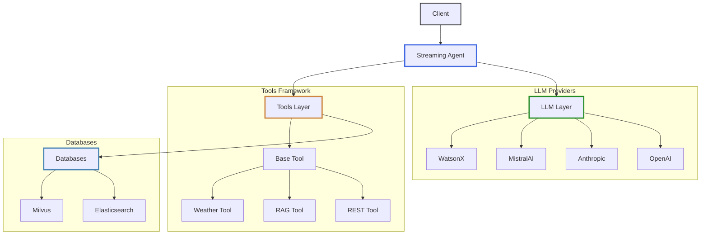

# Code Reference Documentation

---

## Architecture Overview

The codebase implements a flexible framework for integrating and orchestrating Large Language Models (LLMs) with a focus on:

- Vendor-agnostic LLM integration
- Extensible tool framework
- Streaming capabilities
- Pattern detection
- Database integration for RAG applications

### Core Components

#### 🤖 Agent Layer
The agent layer manages conversations and orchestrates interactions between LLMs and tools. It handles:

- Stream management for real-time responses
- Tool execution coordination
- Context management
- Error handling

#### 🔮 LLM Integration
The LLM integration layer provides a unified interface to multiple LLM providers:

- OpenAI
- Anthropic
- MistralAI
- WatsonX (with support for multiple models)

#### 🛠️ Tools Framework
The extensible tools framework enables:

- Custom tool implementation
- JSON and non-JSON response parsing
- REST-based tool integration
- Built-in tools for common use cases (RAG, Weather)

#### 💾  Database Integration
Database support for vector storage and retrieval:

- Elasticsearch integration
- Milvus support
- Query building
- Adapter pattern for database abstraction

---

## Component Relationships



---

## Key Features

### LLM Provider Support
- Vendor-agnostic interface
- Provider-specific prompt builders
- Auth Token management
- Error handling and retry logic

### Tool Framework
- Base classes for rapid tool development
- REST integration support
- Parser framework for response handling
- Registry for tool management

### Pattern Detection
- Real-time text pattern matching
- Aho-Corasick algorithm implementation
- Buffered processing for streaming
- Detection strategy framework

### Database Integration
- Vector storage support
- Connection pooling
- Error handling and retries

---

## Getting Started

### Development Workflow

1. **Understanding the Architecture**

     - Review the [Agent](agent/index.md) documentation
     - Understand [LLM Integration](llm/index.md) patterns
     - Review [Data Models](data_models/index.md)

2. **Implementing New Features**

     - Adding a new tool? Start with [Tools](tools/index.md)
     - New LLM provider? See [LLM Adapters](llm/adapters/index.md)
     - Custom prompt handling? Check [Prompt Builders](prompt_builders/index.md)

3. **Database Integration**

     - Review [Database](database/index.md) documentation


### Common Use Cases

1. **Adding a New LLM Provider**
   ```python
   # 1. Create adapter
   # 2. Add prompt builder
   # 3. Update factory
   # See LLM documentation for details
   ```

2. **Implementing a Custom Tool**
   ```python
   # 1. Extend BaseTool or BaseRESTTool
   # 2. Register in ToolRegistry
   # 3. Add to configuration
   # See Tools documentation for details
   ```

3. **Database Integration**
   ```python
   # 1. Choose adapter
   # 2. Configure connection
   # 3. Build queries
   # See Database documentation for details
   ```

---

## Quick Reference

### Common Components
- [Agent](agent/index.md) - Core orchestration
- [LLM](llm/index.md) - Language model integration
- [Tools](tools/index.md) - Tool framework
- [Database](database/index.md) - Storage integration
- [API](api/index.md) - REST endpoints

### Utility Components
- [Data Models](data_models/index.md) - Shared data structures
- [Utils](utils/index.md) - Common utilities
- [Prompt Builders](prompt_builders/index.md) - LLM prompting

---