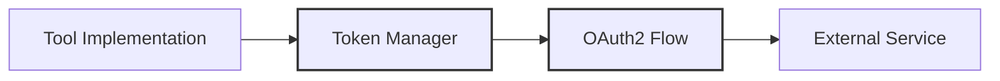

# Tools Utilities

## Overview

The Tools Utilities module provides essential support functions for the tools system, including:

- Token management and authentication
- Tool discovery and instantiation
- Configuration handling

Example using token manager:

## Components

### Token Management (`token_manager.py`)

Handles OAuth2 authentication and token lifecycle:

- Client credentials flow for secure API access
- Automatic token refresh before expiration
- Thread-safe operations with asyncio
- Comprehensive error handling and logging

### Tool Builder (`tool_builder.py`)

Creates tool instances from configuration:

- Supports both custom and config-based tools
- Dynamic class loading and instantiation
- Configuration validation and error handling

### Tool Discovery (`tool_discovery.py`)

Automatically discovers available tool implementations:

- Scans the implementations package for tool classes
- Maps tool names to their implementing classes
- Provides a registry of available tools to the factory

---