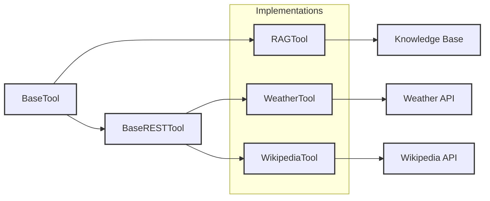

# Tool Implementations

## Overview

The implementations directory contains concrete tool implementations that extend the base tool classes to provide specific functionalities. Each tool is designed to handle particular use cases while adhering to the common interfaces defined in the base classes.

---



---

## Provided Example Tools

### [RAG Tool](rag_tool.md)

The RAG (Retrieval-Augmented Generation) tool enables context-aware responses by incorporating information from external knowledge bases.

**Key Features:**

- Dynamic knowledge retrieval
- Contextual response generation
- Configurable similarity thresholds
- Support for multiple knowledge base formats

### [Weather Tool](weather_tool.md)

The Weather tool provides access to weather information through integration with weather service APIs.

**Key Features:**

- Current weather conditions
- Weather forecasts
- Location-based queries
- Multiple unit support (metric/imperial)

### [Wikipedia Tool](wikipedia_tool.md)

The Wikipedia tool enables direct access to Wikipedia's vast knowledge base through its API integration.

**Key Features:**

- Article retrieval and summarization
- Cross-reference link extraction
- Multi-language support
- Search functionality with relevance ranking

---

## Implementation Guidelines

When creating new tool implementations, follow these guidelines:

1. **Inheritance**
     - Extend either `BaseTool` or `BaseRESTTool`
     - Implement all required abstract methods
     - Call `super().__init__()` in constructor

2. **Stream Context Integration**: StreamContext enables tools to access and interact with the conversation session state. It provides:
     - Access to conversation history and message buffers for context-aware processing and responses
     - Tool definitions and current tool calls to coordinate complex multistep operations
     - Session metadata and configuration for customized tool behavior
     - LLM factory methods for dynamic model access and generation 
     - For detailed documentation, see [Agent Data Models](../../data_models/agent.md).

3. **Error Handling**
     - Use appropriate exception classes
     - Provide meaningful error messages
     - Handle API-specific error cases
     - Include proper logging

4. **Configuration**
     - Use environment variables for sensitive data
     - Make tool behavior configurable
     - Document all configuration options

5. **Response Format**
     - Return structured data
     - Follow consistent response patterns
     - Include status indicators
     - Provide error details when needed

---

## Creating New Tools

### Registration Process

Tools are registered using the `@ToolRegistry.register_tool()` decorator. Here's a step-by-step guide:

1. **Create Tool Class File**
     - Create a new Python file in the `implementations/` directory
     - Import required base classes and the registry decorator:
   ```python
   from src.tools.core.tool_registry import ToolRegistry
   from src.tools.core.base_tool import BaseTool  # or BaseRESTTool
   ```

2. **Define Your Tool Class**
     - Create a class that extends the appropriate base class
     - Add the registration decorator
     - Define a unique `name` class attribute (this should match the tool name in config if using one)
   ```python
   @ToolRegistry.register_tool()
   class MyTool(BaseTool):
       name = "my_tool"  # Required: unique identifier for the tool
       
       def __init__(self, config: Optional[Dict] = None):
           super().__init__(config=config)
           self.description = 'Description of what your tool does'
   ```

3. **Implementation Requirements**
     - Implement all required abstract methods from the base class
     - Add proper error handling and logging
     - Include comprehensive documentation
     - Write unit tests (recommended)

### Example Implementation

Here's a complete example using the Weather Tool:

```python
from typing import Optional, Dict
from src.tools.core.tool_registry import ToolRegistry
from src.tools.core.base_rest_tool import BaseRESTTool

@ToolRegistry.register_tool()
class WeatherTool(BaseRESTTool):
    name = "weather_tool"
    
    def __init__(self, config: Optional[Dict] = None):
        super().__init__(config=config)
        self.description = 'Get current weather information for a location'
        self.strict = False
        
    # Implement required methods...
```

### Registration Options

The `@ToolRegistry.register_tool()` decorator accepts these parameters:

- `hidden` (bool, optional): If True, the tool will be registered as hidden and only accessible via `get_hidden_tool()`. Defaults to False.

Example with hidden tool:
```python
@ToolRegistry.register_tool(hidden=True)
class InternalTool(BaseTool):
    name = "internal_tool"
    # ... rest of implementation
```

### Implementation Checklist

1. ✅ Create new file in implementations directory
2. ✅ Import ToolRegistry and appropriate base class
3. ✅ Add `@ToolRegistry.register_tool()` decorator
4. ✅ Define unique name class attribute
5. ✅ Implement required methods
6. ✅ Add comprehensive documentation
7. ✅ Write unit tests (recommended)

---

## Quick Links: 
- 📖 See [Example RAG Tool (medicare handbook)](rag_tool.md)
- 🌐 See [Example API tool (weather)](weather_tool.md)
- 📚 See [Example API tool (wikipedia)](wikipedia_tool.md)

---