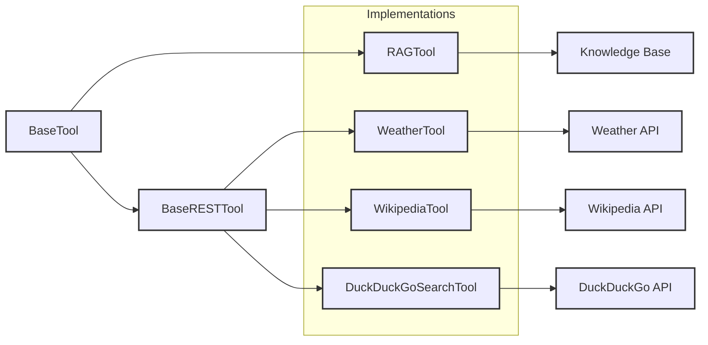

# Tool Implementations

## Overview

The implementations directory contains concrete tool implementations that extend the base tool classes to provide specific functionalities. Each tool is designed to handle particular use cases while adhering to the common interfaces defined in the base classes.

---



---

## Provided Example Tools

### [RAG Tool](rag_tool.md)

The RAG (Retrieval-Augmented Generation) tool enables context-aware responses by incorporating information from external knowledge bases.

**Key Features:**

- Dynamic knowledge retrieval
- Contextual response generation
- Configurable similarity thresholds
- Support for multiple knowledge base formats

### [Weather Tool](weather_tool.md)

The Weather tool provides access to weather information through integration with weather service APIs.

**Key Features:**

- Current weather conditions
- Weather forecasts
- Location-based queries
- Multiple unit support (metric/imperial)

### [Wikipedia Tool](wikipedia_tool.md)

The Wikipedia tool enables direct access to Wikipedia's vast knowledge base through its API integration.

**Key Features:**

- Article retrieval and summarization
- Cross-reference link extraction
- Multi-language support
- Search functionality with relevance ranking

### [DuckDuckGo Search Tool](duckduckgo_tool.md)

The DuckDuckGo Search Tool provides web search capabilities through DuckDuckGo's search engine.

**Key Features:**

- Web search for up-to-date information
- Result extraction with titles, snippets, and URLs
- Markdown-formatted search results
- Configurable result limit
- Robust error handling

---

## Implementation Guidelines

When creating new tool implementations, follow these guidelines:

1. **Inheritance**
     - Extend either `BaseTool` or `BaseRESTTool`
     - Implement all required abstract methods
     - Call `super().__init__()` in constructor

2. **Stream Context Integration**: StreamContext enables tools to access and interact with the conversation session state. It provides:
     - Access to conversation history and message buffers for context-aware processing and responses
     - Tool definitions and current tool calls to coordinate complex multistep operations
     - Session metadata and configuration for customized tool behavior
     - LLM factory methods for dynamic model access and generation 
     - For detailed documentation, see [Agent Data Models](../../data_models/agent.md).

3. **Error Handling**
     - Use appropriate exception classes
     - Provide meaningful error messages
     - Handle API-specific error cases
     - Include logging

4. **Configuration**
     - Use environment variables for sensitive data
     - Make tool behavior configurable
     - Document all configuration options

5. **Response Format**
     - Return structured data
     - Follow consistent response patterns
     - Include status indicators
     - Provide error details when needed

---

## Creating New Tools

### Tool Configuration Example

Below is an example of how tools are configured in the agent.yaml file:

```yaml
tools_config:
  # Weather API Integration
  - name: "weather"
    endpoint_url: "https://api.openweathermap.org/data/2.5/weather"
    api_key_env: "OWM_API_KEY"

  # Wikipedia Summary Tool
  - name: "wikipedia"
    endpoint_url: "https://{lang}.wikipedia.org/api/rest_v1/page/summary/{encoded_query}"

  # DuckDuckGo Search Tool
  - name: "duckduckgo_search"

  # RAG Tool with Elasticsearch
  - name: "medicare_search"
    connector_config:
      connector_type: elasticsearch
      index_name: my_index
      api_key_env: ES_API_KEY
      endpoint_env: ES_ENDPOINT
      top_k: 5
      # Additional configuration options...
```

The configuration specifies which tools should be registered and provides any necessary configuration parameters for each tool.

### Registration Process

Tools are registered through the Flexo `agent.yaml` configuration file. Here's the step-by-step guide:

1. **Create Tool Class File**
     - Create a new Python file in the `implementations/` directory
     - Import required base classes:
   ```python
   from src.tools.core.base_tool import BaseTool  # or BaseRESTTool
   ```

2. **Define Your Tool Class**
     - Create a class that extends the appropriate base class
     - Define a unique `name` class attribute (this must match the tool name in your config)
   ```python
   class MyTool(BaseTool):
       name = "my_tool"  # Required: unique identifier for the tool
       
       def __init__(self, config: Optional[Dict] = None):
           super().__init__(config=config)
           self.description = 'Description of what your tool does'
   ```

3. **Add Tool Configuration to agent.yaml**
     - Add your tool configuration under the `tools_config` section:
   ```yaml
   tools_config:
     # Other tools...
     - name: "my_tool"
       # Optional tool-specific configuration
       endpoint_url: "https://api.example.com/v1/endpoint"
       api_key_env: "MY_TOOL_API_KEY"
   ```

3. **Implementation Requirements**
     - Implement all required abstract methods from the base class
     - Add error handling and logging
     - Include documentation
     - Write unit tests (recommended)

### Example Implementation

Here's an example using the Weather Tool:

#### Python Implementation

```python
from typing import Optional, Dict
from src.tools.core.base_rest_tool import BaseRESTTool

class WeatherTool(BaseRESTTool):
    name = "weather"  # Must match the name in tools_config

    def __init__(self, config: Optional[Dict] = None):
        super().__init__(config=config)
        self.description = 'Get current weather information for a location'
        self.strict = False

    # Implement required methods...
```

#### Configuration in agent.yaml

```yaml
tools_config:
  - name: "weather"
    endpoint_url: "https://api.openweathermap.org/data/2.5/weather"
    api_key_env: "OWM_API_KEY"
```

### Configuration Options

The tools configuration in agent.yaml supports various options depending on the tool type:

- **Basic API Tools**: Configure endpoints, API keys, and other connection parameters
- **RAG Tools**: Specify connector configurations, vector databases, and search parameters  
- **Hidden Tools**: Tools can be made available only to the system by excluding them from the `tools_config`

### Implementation Checklist

1. ✅ Create new file in implementations directory
2. ✅ Import appropriate base class
3. ✅ Define unique name class attribute (must match configuration)
4. ✅ Implement required methods
5. ✅ Add documentation
6. ✅ Add tool to your `tools_config` list in `agent.yaml`
7. ✅ Write unit tests (recommended)

---

## Quick Links: 
- See [Example RAG Tool (medicare handbook)](rag_tool.md)
- See [Example API tool (weather)](weather_tool.md)
- See [Example API tool (wikipedia)](wikipedia_tool.md)
- See [Example API tool (duckduckgo search)](duckduckgo_tool.md)

---