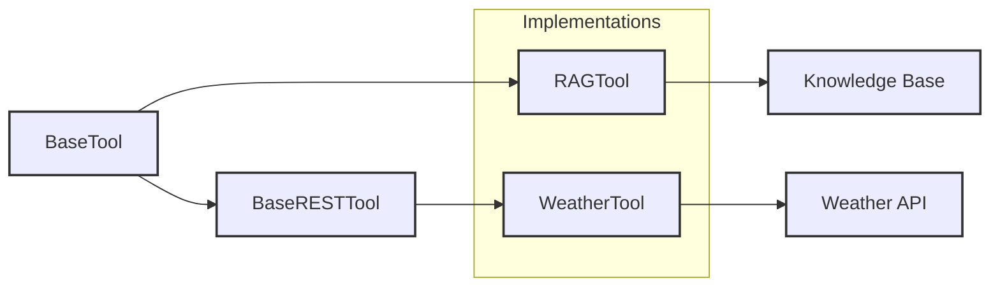

# Tool Implementations

## Overview

The implementations directory contains concrete tool implementations that extend the base tool classes to provide specific functionalities. Each tool is designed to handle particular use cases while adhering to the common interfaces defined in the base classes.

---

---

## Available Tools

### RAG Tool (rag_tool.md)

The RAG (Retrieval-Augmented Generation) tool enables context-aware responses by incorporating information from external knowledge bases.

**Key Features:**
- Dynamic knowledge retrieval
- Contextual response generation
- Configurable similarity thresholds
- Support for multiple knowledge base formats

### Weather Tool (weather_tool.md)

The Weather tool provides access to weather information through integration with weather service APIs.

**Key Features:**
- Current weather conditions
- Weather forecasts
- Location-based queries
- Multiple unit support (metric/imperial)

---

## Implementation Guidelines

When creating new tool implementations, follow these guidelines:

1. **Inheritance**
   - Extend either `BaseTool` or `BaseRESTTool`
   - Implement all required abstract methods
   - Call super().__init__() in constructor

2. **Error Handling**
   - Use appropriate exception classes
   - Provide meaningful error messages
   - Handle API-specific error cases
   - Include proper logging

3. **Configuration**
   - Use environment variables for sensitive data
   - Make tool behavior configurable
   - Document all configuration options

4. **Response Format**
   - Return structured data
   - Follow consistent response patterns
   - Include status indicators
   - Provide error details when needed

---

## Creating New Tools

Follow this checklist when creating new tool implementations:

1. ✅ Create new file in implementations directory
2. ✅ Import appropriate base class
3. ✅ Implement required methods
4. ✅ Add comprehensive documentation
5. ✅ Include usage examples
6. ✅ Write unit tests (optional, recommended)
7. ✅ Register with ToolRegistry

---

## Quick Links: 
- 📖 See [Example RAG Tool](rag_tool.md)
- 🌐 See [Example API tool (weather)](weather_tool.md)

---