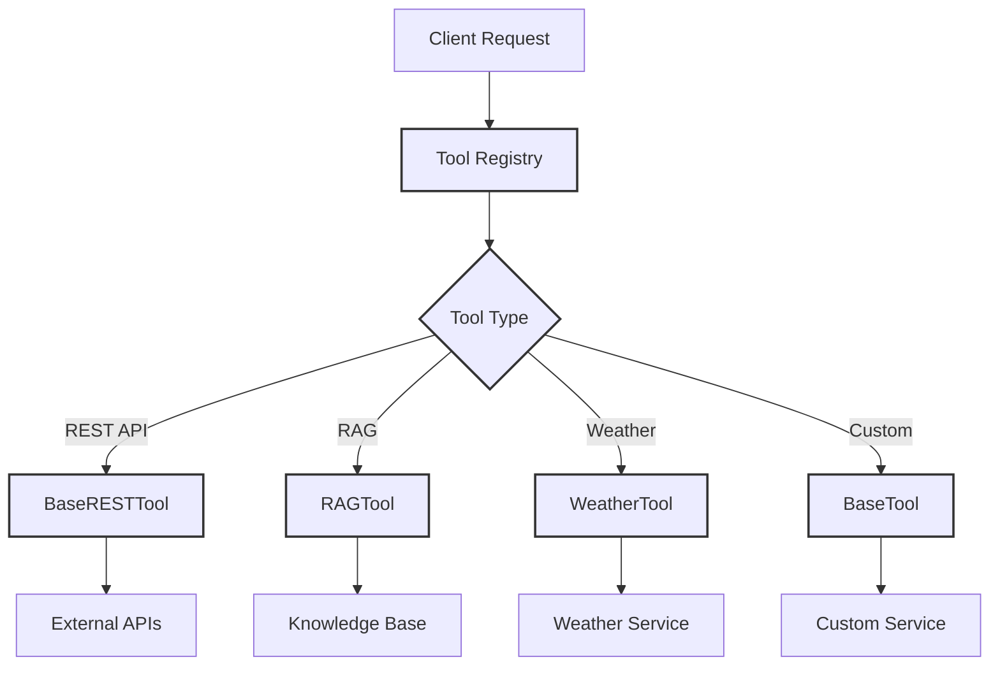
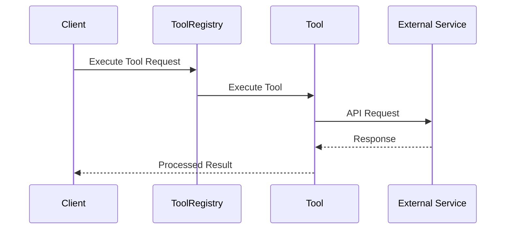

# 🛠️ Tools Documentation

## 📚 Overview

The Tools component provides a powerful and extensible framework for implementing and managing external tool integrations. This module serves as the backbone for all external interactions, enabling the system to perform specific actions and retrieve information from various services.

---

---

## 🏗️ Component Architecture

### Tool Execution Flow (API Tool Example)

---

## 🧱 Core Components

### Base Tool Interfaces
Located in `src/tools/core/`:

- **📘 BaseTool**
    - Foundation interface for all tools
    - Defines standard execution patterns
    - See [Base Tool](base_tool.md)

- **🌐 BaseRESTTool**
    - Extended functionality for REST APIs
    - Built-in HTTP method handling
    - See [Base Rest Tool](base_rest_tool.md)

- **📋 ToolRegistry**
    - Central tool management system
    - Handles tool registration and access
    - See [Tool Registry](tool_registry.md)

### 🛠️ Example Tool [Implementations](implementations/index.md)
Located in `src/tools/implementations/`:

- **🔍 RAGTool**
    - Retrieval-Augmented Generation
    - Enhances responses with external knowledge
    - See [Rag Tool Example](implementations/rag_tool.md)

- **🌤️ WeatherTool**
    - Weather information service integration
    - Real-time weather data access
    - See [Weather Tool Example](implementations/weather_tool.md)

- **📚 WikipediaTool**
    - Wikipedia article retrieval and summarization
    - Access to comprehensive knowledge base
    - See [Wikipedia Tool Example](implementations/wikipedia_tool.md)

### ⚙️ Utils
Located in `src/tools/core/utils/`:

- **🔑 TokenManager**
    - OAuth2 credential management
    - Secure token handling
    - See [Token Manager](utils/token_manager.md)

### 📝 Parsers
Located in `src/tools/core/parsers/`:

- **📊 BaseToolCallParser**
    - Abstract parsing interface
    - See [Base Parser](parsers/base_tool_call_parser.md)

- **📋 JSONToolCallParser**
    - JSON format handling
    - See [JSON Parser](parsers/json_tool_call_parser.md)

- **📜 NonJSONToolCallParser**
    - Alternative format support
    - See [Non-JSON Parser](parsers/non_json_tool_call_parser.md)

---

## 📚 Further Documentation

- 📖 See [Base Tool](base_tool.md) for custom tool creation
- 🌐 See [Base REST Tool](base_rest_tool.md) for REST implementation details
- 🛠️ Check [Tool Implementations](implementations/index.md) for specific tool documentation
- 📝 Visit [Parsers](parsers/index.md) for parsing documentation
- ⚙️ Explore [Utils](utils/index.md) for utility references

---

## 🔒 Security Best Practices

1. Always use environment variables for sensitive credentials
2. Implement proper request validation
3. Use HTTPS for external communications
4. Follow least privilege principle
5. Regularly audit tool access patterns

---