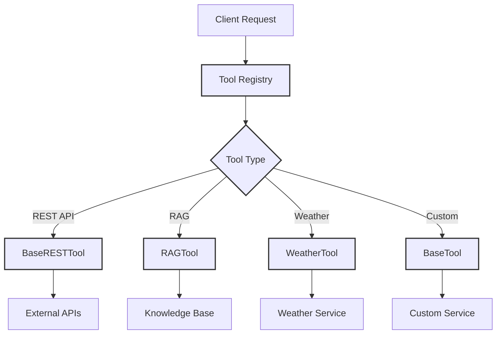
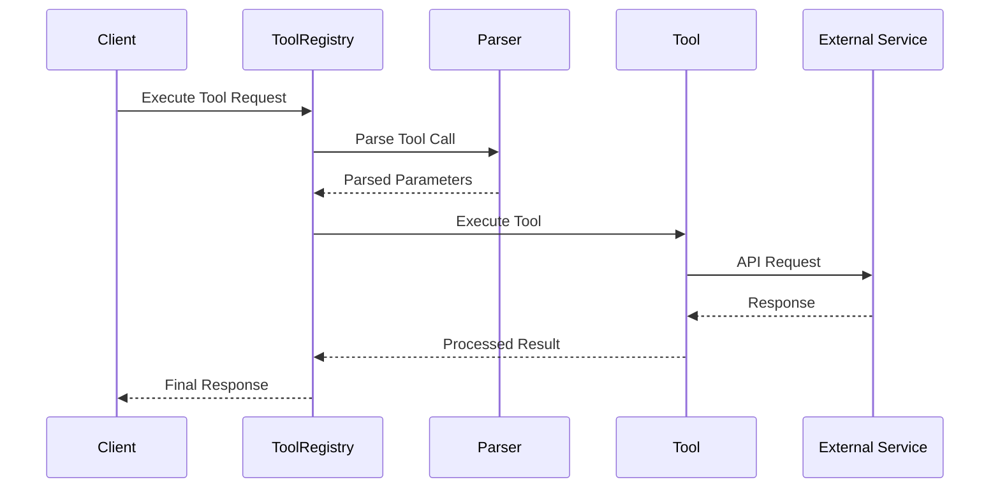

# 🛠️ Tools Documentation

## 📚 Overview

The Tools component provides a powerful and extensible framework for implementing and managing external tool integrations. This module serves as the backbone for all external interactions, enabling the system to perform specific actions and retrieve information from various services.

---

---

## 🏗️ Component Architecture

### Tool Execution Flow

---

## 🧱 Core Components

### Base Tools
- **📘 BaseTool**
  - Foundation interface for all tools
  - Defines standard execution patterns
  - Located in `base_tool.md`

- **🌐 BaseRESTTool**
  - Extended functionality for REST APIs
  - Built-in HTTP method handling
  - Located in `base_rest_tool.md`

- **📋 ToolRegistry**
  - Central tool management system
  - Handles tool registration and access
  - Located in `tool_registry.md`

### 🛠️ Tool Implementations
Located in `implementations/`:

- **🔍 RAGTool**
  - Retrieval-Augmented Generation
  - Enhances responses with external knowledge
  - Located in `rag_tool.md`

- **🌤️ WeatherTool**
  - Weather information service integration
  - Real-time weather data access
  - Located in `weather_tool.md`

### 📝 Parsers
Located in `parsers/`:

- **📊 BaseToolCallParser**
  - Abstract parsing interface
  - Located in `base_tool_call_parser.md`

- **📋 JSONToolCallParser**
  - JSON format handling
  - Located in `json_tool_call_parser.md`

- **📜 NonJSONToolCallParser**
  - Alternative format support
  - Located in `non_json_tool_call_parser.md`

### ⚙️ Utils
Located in `utils/`:

- **🔑 TokenManager**
  - OAuth2 credential management
  - Secure token handling
  - Located in `token_manager.md`

---

## 📚 Further Documentation

- 📖 See [base_tool](base_tool.md) for custom tool creation
- 🌐 See [base_rest_tool](base_rest_tool.md) for REST implementation details
- 🛠️ Check [implementations](implementations/index.md) for specific tool documentation
- 📝 Visit [parsers](parsers/index.md) for parsing documentation
- ⚙️ Explore [utils](utils/index.md) for utility references

---

## 🔒 Security Best Practices

1. Always use environment variables for sensitive credentials
2. Implement proper request validation
3. Use HTTPS for external communications
4. Follow least privilege principle
5. Regularly audit tool access patterns

---