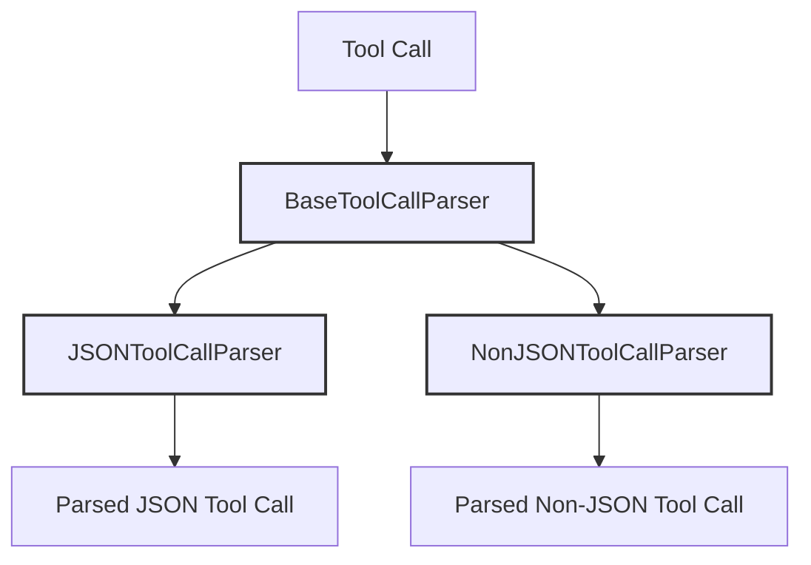

# Tool Parsers Documentation

## Overview

The parsers module provides a robust framework for parsing and validating tool calls in different formats. It ensures consistent handling of tool invocations regardless of the input format, making the system more flexible and maintainable.

---

## Key Components

### BaseToolCallParser

The abstract base class that defines the core interface for all tool call parsers. It provides:

- Common validation logic
- Error handling patterns
- Standard parsing workflow
- Type checking utilities

### JSONToolCallParser

Specialized parser for handling JSON-formatted tool calls. Features include:

- Strict JSON schema validation
- Type coercion for parameters
- Nested object support
- Error messages for malformed JSON
- Parameter validation against tool specifications

### NonJSONToolCallParser

Parser implementation for handling tool calls in alternative formats. Capabilities include:

- Support for structured text formats
- Parameter extraction from non-JSON inputs
- Flexible format handling
- Conversion to standardized internal format

---

## Related Documentation

- See [base_tool_call_parser](base_tool_call_parser.md) for the base parser interface
- See [json_tool_call_parser](json_tool_call_parser.md) for JSON parsing details
- See [non_json_tool_call_parser](non_json_tool_call_parser.md) for alternative format handling

---
