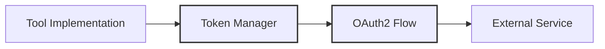

# Tools Utilities Documentation

## Overview

The Tools Utilities module provides essential support functions and classes for authentication, token management, and other common operations used across different tools in the system. These utilities ensure consistent handling of cross-cutting concerns like authentication and authorization.

## Components

### Token Management

The primary component in the utils module is the OAuth2 token management system, which handles:

- Client credentials flow authentication
- Token lifecycle management
- Automatic token refresh
- Secure credential storage

### Key Features

- **Automated Token Refresh**: Handles token expiration and renewal automatically
- **Secure Credential Management**: Safe handling of sensitive authentication data
- **Thread-Safe Operations**: Ensures concurrent access is handled properly
- **Error Handling**: Robust error management for authentication failures

## Related Documentation

- See [token_manager](token_manager.md) for Complete documentation of the OAuth2 token management system
- See [base_rest_tool](../base_rest_tool.md) for integration with REST-based tools

---