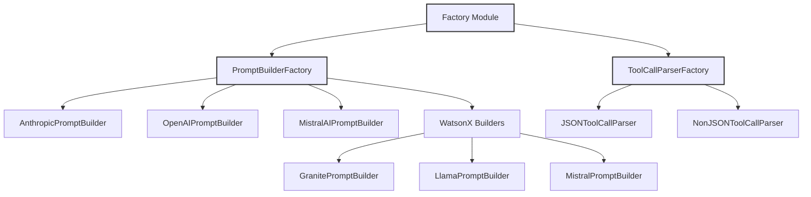

# Utils Documentation

## Overview

The Utils module provides essential factory patterns and utility classes that support the core functionality of the system. These utilities focus on creating and managing different types of builders, parsers, and formatters used throughout the application.

---

## Components

### Factory Classes

**`PromptBuilderFactory`**

- Creates appropriate prompt builders based on vendor type
  - Supports multiple LLM providers:
    - Anthropic
    - OpenAI
    - MistralAI
    - WatsonX (Granite, Llama, Mistral)

**`ToolCallParserFactory`**

- Generates parser instances for tool calls
  - Supports:
    - JSON format parsing
    - Non-JSON format parsing

### Enums

**`FormatType`**

- Defines supported format types for tool calls
  - Used by parser factories
  - Located in `factory.md`

---

## Implementation Details

### Factory Pattern Benefits

1. **Abstraction**: Hides complex instantiation logic
2. **Flexibility**: Easy to add new builders and parsers
3. **Consistency**: Ensures uniform object creation
4. **Maintainability**: Centralizes creation logic

---

## Further Documentation

- See individual builder documentation in [prompt_builders](../prompt_builders/index.md) directory
- Check parser implementations in [parsers](../tools/core/parsers/index.md) directory
- Review format types and enums in [factory](factory.md)

---